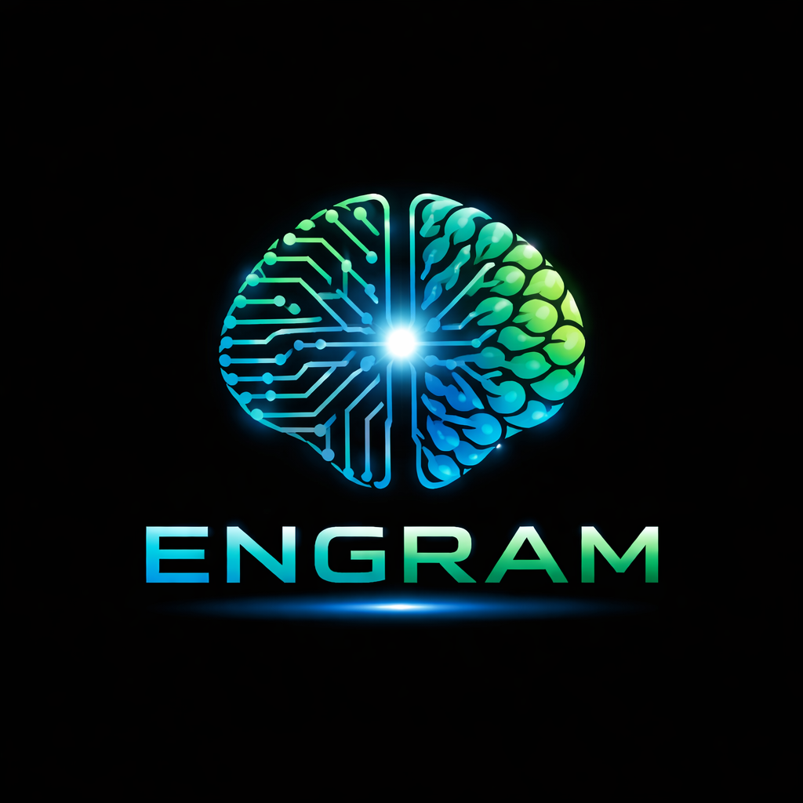

<div align="center">



**Self-improving procedural memory for Claude Code**

[](https://opensource.org/licenses/MIT)
[](https://www.python.org/downloads/)
[](https://github.com/entropycloud/engram/actions)
[](https://github.com/entropycloud/engram/releases)

</div>

---

## What is Engram?

When you use Claude Code, it can remember facts about your project — things like "this repo uses pytest" or "the database is PostgreSQL." That's **declarative memory**. It's useful, but it's not the whole picture.

**Engram adds procedural memory** — it remembers *how to do things*, not just what things are.

Think of it like the difference between knowing that a kitchen has an oven (declarative) vs. knowing the steps to bake a cake in *that specific oven* with *its specific quirks* (procedural).

### A real example

You spend 45 minutes working with Claude Code to deploy a tricky service. Along the way, you discover that:

1. Migrations must run *before* the service restarts (the healthcheck queries new tables)
2. The staging config needs a specific env var override that isn't documented
3. The deploy script silently fails if you forget to pull the latest Docker image first

Without Engram, that knowledge lives in your session history and your head. Next time you (or a teammate) deploy, Claude Code starts from scratch.

**With Engram**, at the end of that session, the system automatically reviews what happened and captures the procedure:

> *"When deploying service-x: pull latest Docker image first, run migrations before restart, set STAGING_OVERRIDE=true for staging deploys. The healthcheck will fail if migrations haven't completed."*

Next time someone asks Claude Code to deploy that service, Engram injects that knowledge into the session automatically. Claude Code doesn't rediscover the process — it already knows it.

### More examples of what Engram captures

- **Debugging workflows**: "When this service throws OOM errors, check the batch size config first — it defaults to 10k but this dataset needs 1k"
- **Project conventions**: "New API endpoints in this repo follow the pattern: write test first, add route in `src/routes/`, register in `src/app.py`, update OpenAPI spec"
- **Environment setup**: "After cloning, you need to run `./scripts/seed-db.sh` before tests will pass — the test fixtures depend on seed data"
- **Incident patterns**: "When the queue backs up, don't restart the worker — scale it horizontally. Restarting drops in-flight messages"

### What Engram is NOT

- **Not a documentation generator.** Engram doesn't write docs, READMEs, or wikis. It stores terse, actionable procedures for Claude Code to follow — not human-readable documentation.
- **Not a knowledge base or search engine.** You can't ask it questions. It works silently in the background, injecting relevant procedures when it detects a match.
- **Not a replacement for CLAUDE.md.** Project instructions, coding standards, and preferences still belong in CLAUDE.md. Engram is for learned procedures that emerge from real work — things you wouldn't think to write down in advance.
- **Not magic.** It needs a few sessions of real work before it has anything useful. The value compounds over time as procedures are captured, tested, scored, and refined.
- **Not a general-purpose AI memory system.** It's specifically designed for Claude Code's hook system. It doesn't work with other tools or AI assistants.

---

## Installation

### Prerequisites

You need two things:
- **Python 3.11 or newer** — check with `python3 --version`
- **uv** (Python package manager) — if you don't have it, we'll install it below

### Step 1: Install uv

If you already have `uv` installed, skip this step. Otherwise:

```bash
curl -LsSf https://astral.sh/uv/install.sh | sh
```

Close and reopen your terminal (or run `source ~/.bashrc` / `source ~/.zshrc`) so the `uv` command is available.

Verify it works:

```bash
uv --version
```

### Step 2: Install Engram

Clone the repo and install:

```bash
git clone https://github.com/entropycloud/engram.git
cd engram
uv tool install -e ".[llm]"
```

The `[llm]` part installs the AI libraries needed for automatic session review. If you only want to import/export engrams manually (no automatic review), you can omit it:

```bash
uv tool install -e "."
```

Verify the installation:

```bash
engram --version
# Should print: engram, version 0.1.0
```

### Step 3: Set up API credentials

Engram needs to call Claude to review your sessions. You need **one** of these configured:

**Option A: AWS Bedrock** (if your organization uses AWS)

```bash
# Add these to your shell profile (~/.bashrc, ~/.zshrc, etc.)
export CLAUDE_CODE_USE_BEDROCK=1
export AWS_REGION="us-east-1"
export AWS_BEARER_TOKEN_BEDROCK="your-aws-token-here"
```

**Option B: Anthropic API key** (direct access)

```bash
# Add this to your shell profile
export ANTHROPIC_API_KEY="sk-ant-your-key-here"
```

If you're not sure which one you use, check how Claude Code is configured in your environment — Engram uses the same credentials.

### Step 4: Install hooks

You have two options:

**Option A: Project-level** (recommended to start) — engrams are scoped to one project:

```bash
cd /path/to/your/project
engram install --project
```

This stores engram data in `.engram/` at the project root and hooks in `.claude/settings.json`.

**Option B: Global** — engrams are shared across all projects:

```bash
engram install --global
```

This stores engram data in `~/.claude/engrams/` and hooks in `~/.claude/settings.json`.

You can verify the hooks are installed by checking the relevant `settings.json` — you should see `engram` commands in the hooks section.

> **Tip:** Start with one project. Once you're comfortable with how it works, you can expand to global or install on more projects.

To remove (your engram data is preserved):

```bash
engram uninstall --project   # or --global
```

---

## How it works

Here's what happens during a normal Claude Code session with Engram installed:

### During the session

**Every time you send a prompt**, the select hook runs in the background (typically under 100ms — it never blocks your prompt). It checks if any of your stored engrams are relevant to what you're asking about. If it finds a match, it injects the procedure into the session context so Claude Code can see it and follow it.

**Every time a tool runs** (file reads, edits, bash commands, etc.), a lightweight signal is recorded. This is used for scoring later.

### When the session ends

**The review hook fires** (runs after the session is over, so you never wait for it). It:

1. Loads the session transcript (the full record of what happened)
2. Checks which engrams were injected during the session
3. Sends the transcript to Claude for analysis
4. Claude decides:
   - Should any new procedures be captured? → Creates new engrams as **draft**
   - Were the injected engrams helpful? → Records **success** signals
   - Were the injected engrams ignored? → Records **override** signals
5. Quality scores are updated based on these signals

### After the session

New engrams start as **draft** — they won't be injected into sessions until you review and promote them. This is intentional. You should review what was captured before it starts influencing your sessions.

```bash
# See what was captured
engram list

# Read the full procedure
engram view <slug>

# If it looks good, promote it
engram promote <slug>          # draft → candidate (starts being injected)
engram promote <slug>          # candidate → stable (full confidence injection)
```

### Over time

As engrams get used across sessions, their quality scores change:

- Engrams that are consistently followed get **higher scores** and are promoted
- Engrams that are consistently ignored get **lower scores** and are eventually deprecated
- Unused engrams slowly decay and can be archived by garbage collection
- You can **pin** important engrams to protect them from decay: `engram pin <slug>`

---

## CLI reference

### Browsing

```bash
engram list                    # list all engrams
engram list --state candidate  # filter by state
engram list --tag deployment   # filter by tag
engram view <slug>             # full engram with rendered frontmatter
engram stats                   # quality metrics overview
engram stats --slug <slug>     # detailed metrics for one engram
```

### Lifecycle management

```bash
engram promote <slug>     # draft → candidate → stable
engram demote <slug>      # reset to draft for rework
engram deprecate <slug>   # mark as deprecated
engram archive <slug>     # move to archive
engram pin <slug>         # prevent staleness decay and archival
engram unpin <slug>       # allow normal scoring again
```

### Feedback

```bash
engram rate <slug> up     # "this engram helped" — boosts score
engram rate <slug> down   # "this engram was wrong" — lowers score
```

### Review

```bash
engram review --mode auto                      # review with LLM
engram review --transcript <path> --mode auto  # review specific transcript
engram review --dry-run                        # see the prompt without calling LLM
engram review --model <model-id>               # use a different model
```

### Import / export

```bash
engram import <file.md>          # import engram from markdown file
engram export <slug>             # export to standalone markdown
engram export-skill <slug>       # export as Claude Code SKILL.md file
```

### Maintenance

```bash
engram rebuild-index    # rebuild index from engram files
engram gc               # archive stale engrams, clean orphan files
engram scan <slug>      # security scan on engram content
engram dedup <slug>     # find potential duplicate engrams
```

### Integration

```bash
engram install --project     # install hooks for current project
engram install --global      # install hooks globally
engram uninstall --project   # remove hooks (keeps engram data)
engram uninstall --global
```

---

## Engram lifecycle

```
draft ──► candidate ──► stable ──► deprecated ──► archived
  ▲           │            │
  └───────────┘            │
  └── demote ──────────────┘
```

| State | Injected into sessions? | How it gets there |
|-------|------------------------|-------------------|
| **draft** | No | Auto-created by the reviewer at session end |
| **candidate** | Yes, lower confidence | You run `engram promote <slug>` |
| **stable** | Yes, full confidence | You run `engram promote <slug>` again |
| **deprecated** | No | Quality score drops below threshold |
| **archived** | No | GC runs after 90 days deprecated with 0 usage |

**Pinned engrams** are immune to staleness decay and cannot be archived by GC. Use `engram pin <slug>` for procedures you know are correct regardless of how often they're used.

---

## Storage

Project-level installs store data in `.engram/` at the project root. Global installs use `~/.claude/engrams/`.

```
.engram/
├── engram/       # Active engram files (*.md with YAML frontmatter)
├── archive/      # Archived engrams
├── metrics/      # Usage signals (*.jsonl per engram)
├── versions/     # Version history snapshots
└── index.json    # Fast-lookup index (auto-rebuilt on writes)
```

Each engram is a markdown file with YAML frontmatter (metadata, triggers, metrics) and a markdown body (the procedure itself).

---

## Security

All engram content is security-scanned before being written to the store:

- Command injection patterns
- Prompt injection attempts
- Sensitive data (API keys, credentials, tokens)
- Unsafe tool references based on trust level

Agent-created engrams are restricted to safe tools (`Read` only) by default. Human-reviewed engrams can be granted broader tool access through trust level promotion.

---

## Releasing

Engram uses GitHub Releases triggered by version tags:

```bash
# Update version in pyproject.toml, then:
git tag v0.1.0
git push origin v0.1.0
```

This triggers the release workflow which runs tests, builds the package, and creates a GitHub Release with auto-generated release notes.

---

## Development

```bash
git clone https://github.com/entropycloud/engram.git
cd engram

# Install all dependencies (dev + LLM)
uv pip install -e ".[dev,llm]"

# Run tests
pytest -v

# Lint
ruff check src/ tests/

# Type check
mypy src/engram/
```

### Project structure

```
src/engram/
├── cli.py          # Click-based CLI commands
├── models.py       # Pydantic v2 data models
├── store.py        # File-based storage with atomic writes
├── selector.py     # 6-stage engram matching pipeline
├── reviewer.py     # Session transcript analysis + prompt building
├── llm.py          # Anthropic / Bedrock API client
├── evaluator.py    # Quality score computation from signals
├── lifecycle.py    # State transitions + garbage collection
├── scanner.py      # Security content scanning
├── hooks.py        # Signal capture for Claude Code hooks
├── install.py      # Claude Code integration installer
└── templates/      # Jinja2 templates for rendering
```

---

## License

[MIT](LICENSE)
